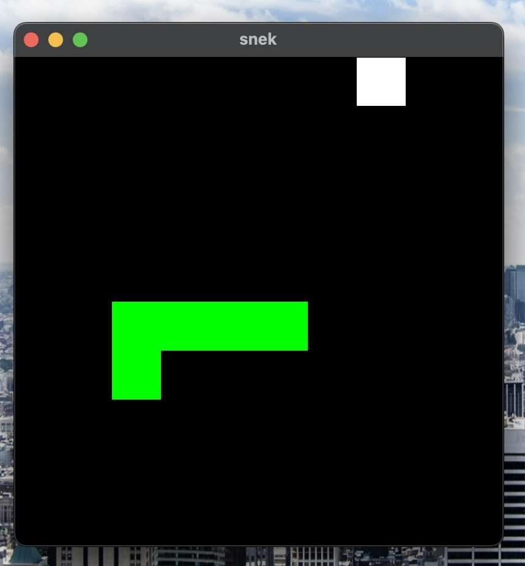
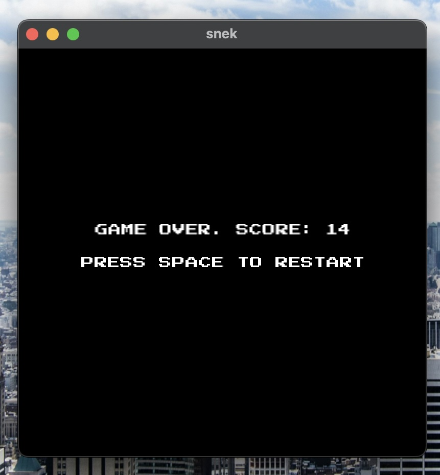

# snek

C++ snake

Made in C++ and SFML in a couple of hours.

Screenshots:

## How to run

- Install SFML (via `brew` works fine).
- Makefile is set for SFML 2.6.1 on MacOS. I haven't tested on other systems.
- Run `make && ./bin/app`.
